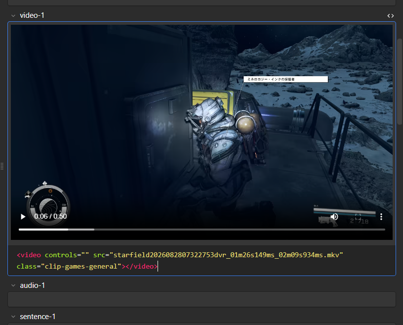
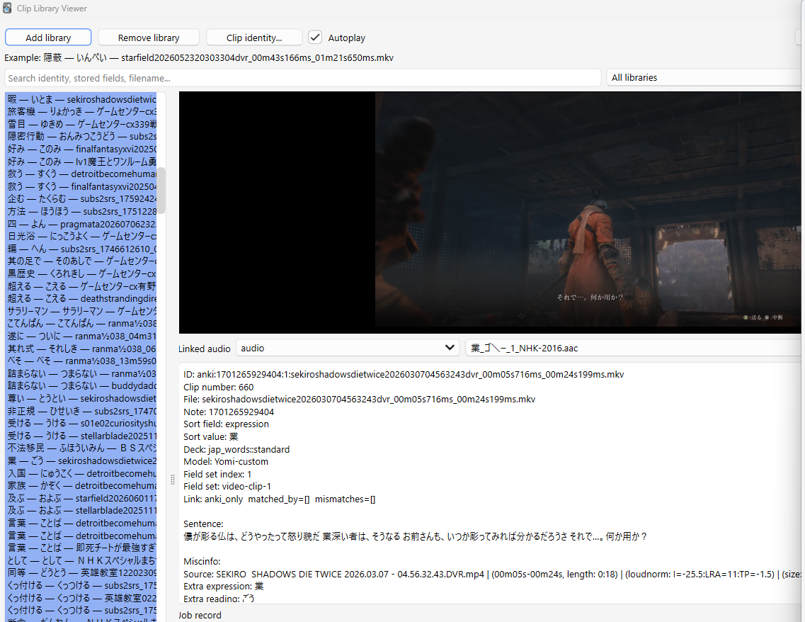
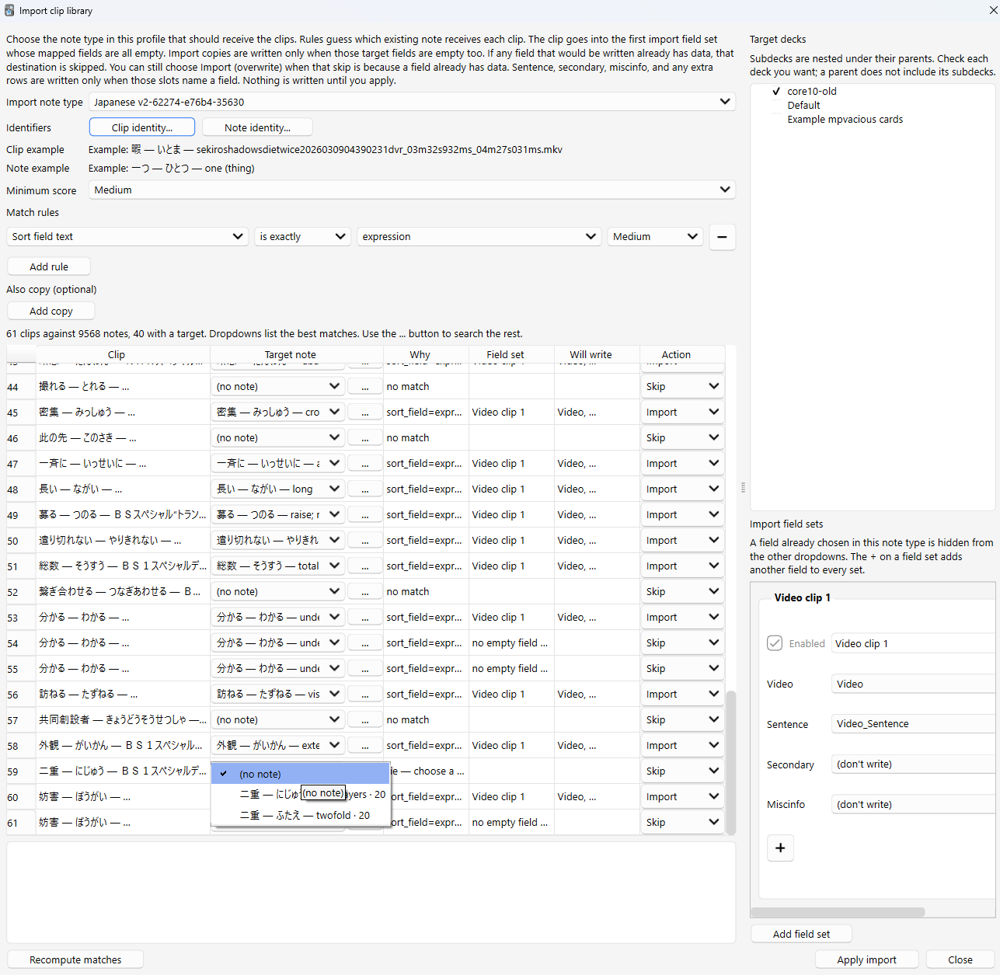

# Video Clip Library

Video Clip Library saves HTML-tag (`<video></video>`) embedded video clips on your Anki cards (embedded on a field, not card template basis) into a folder you can keep, browse, and use again later.
[I use a custom fork of mpvacious to create video clips for anki notes](https://github.com/kent0348-source/mpv-anki-clips/)

> Example of embedded video in a note's field.

## Requirements

- Anki 23.10 or newer
- **mpv** installed and available on your system

If mpv is installed but not found automatically, set its location in the add-on settings.

> On Windows, make sure the `.exe` extension (i.e. `mpv.exe`) is specified to avoid buggy playback.

## Menus

The add-on adds actions to two Anki menus:

### Main menu (`Tools`)

- **Tools > Clip Library > Configure** — Edit the note type, clip field sets, extra rows, exclusion rules, and import field sets. Import field sets can add the same kind of extra rows as export.
- **Tools > Clip Library > Library Viewer** — Open the viewer to browse exported clip libraries, search clips, and play them.

### Browser menu (`Edit`)

Open the **Card Browser** first, then use:

- **Edit > Clip Library: Export selected notes…** — Export video clips from the currently selected notes.
- **Edit > Clip Library: Export deck…** — Export video clips from the entire checked deck (or sub-deck).

## Exporting

From the card browser, export the notes you have selected or a whole deck. The add-on copies the video files. It does **not** move or delete them from Anki.

Each library is a folder of video files plus a JSON file that stores the metadata for each clip: which note it came from, the sentence, and the other fields you choose to keep.

## Library Viewer

Open the library viewer to search your saved clips and play them.

You can also bring clips back into Anki. The add-on suggests the card each clip belongs to, and you can check or change that match before anything is written. It fills the first import field set whose mapped fields are all empty, and writes import copies only when those targets are empty too. Fields that already have data are left alone.

> **NOTE:** It is strongly recommended to backup your entire Anki collection (via **File → Export** from the main Anki window) or create a new Anki profile expressly for testing purposes before trying any of the import functionality. Changes to notes **cannot be undone** — they would have to be reverted manually.

## Use Cases

This is useful if you want:

- A backup of your clips
- A way to watch them outside a review session
- A way to move clips into another Anki collection

## Current assumptions and limitations

The add-on is not a fully generic video extractor. The following assumptions define its scope and explain why it may not work with every setup:

- **Video tags** — Only video files embedded inside a `<video>` HTML tag are scanned. The addon looks for the pattern `<video … src="…">` and extracts the first `src` it finds. Videos embedded using other methods (e.g. `<audio>` tags, plain file paths, custom HTML) are **not** recognized.

- **Supported media extensions** — The addon recognizes only the following video file extensions: `.mkv`, `.mp4`, `.webm`, `.avi`, `.mov`, `.m4v`, `.ts`, `.ogv`, `.wmv`. Other extensions (such as `.flv`, `.3gp`, or `.mxf`) are ignored even if they appear inside a valid `<video>` tag.

- **Note type filter** — During export, only notes of the note type you configure in **Clip Library > Configure** are scanned. Notes of any other note type are skipped entirely.

- **One video per tag** — The addon extracts at most **one** video file per `<video>` tag. If a tag contains multiple `<source>` children, only the `src` on the `<video>` tag itself is considered.

- **Import writes to existing notes only** — Importing clips back into Anki can only fill fields on **existing** notes. The addon **does not** create new notes. A note must have one configured import field set whose mapped fields are all empty, and every import-copy target must be empty too. The addon does not overwrite a destination that already has data, and it does not write part of one.

- **Import uses a scoring system** — The addon matches each clip to the most likely note using configurable import rules (sentence text, filename, timestamps, etc.) with weighted scoring. Clips are only imported when the best match exceeds the configured minimum threshold and has no tie with another note.

- **Import field sets require a video field** — Importing requires at least one enabled import field set with a **video field** specified. Without this the addon cannot write any clips. Extra rows on an import set are optional and are written only when that row names a field.

- **mpv is only needed for playback** — Exporting and importing work without mpv. Playback of clips in the library viewer **requires** mpv to be installed and found (either automatically or via the mpv executable path set in the add-on settings).
